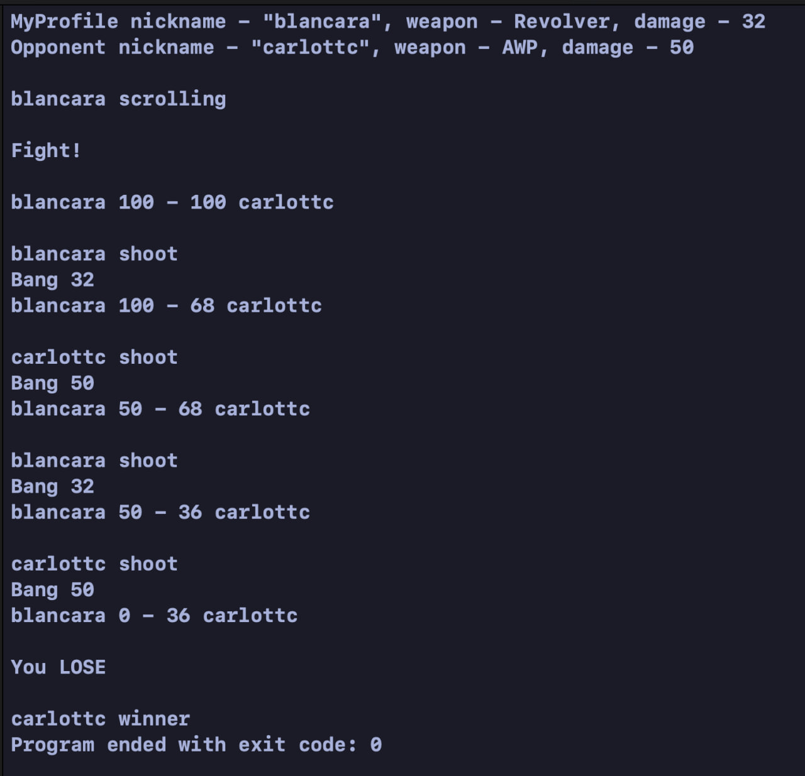

# Gun Game

## Описание
В проекте реализована консольная игра. Создается сервер, на который добавляются игроки. У игрока может быть одно из трех видов оружия:
1. Револьвер (6 патронов в обойме); 
2. Винтовка (однозарядная); 
3. Нож (бесконечный ресур).
Игроку, находищемуся в статусе поиска, подбирается оппонент с тем же статусом и начинается матч.
В зависимости от типа вооружения сервером генерируется запас патронов: для револьвера - 12, для винтовки - 4. Патроны могут быть холостыми и наносят урон, эквивалентный калибру. На старте у каждого игра 100 очков здоровья.
Происходит зарядка оружия, далее, в случайном порядке игроки стреляют. Каждый выстрел сопровождается сообщением: "Bang" и количество нанесенного урона, или "Click", если выстрел пришелся на холостой патрон.
Победа засчитывается тому игроку, для кого нашли оппонента, только в том случае, если он опустил здоровье противника меньше нуля (принцип атакующего и защитника). Каждый ход выводит здоровье игроков. 

## Пример работы
 
